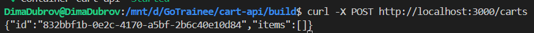
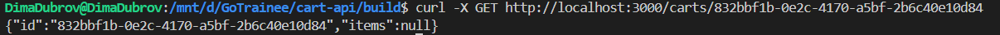
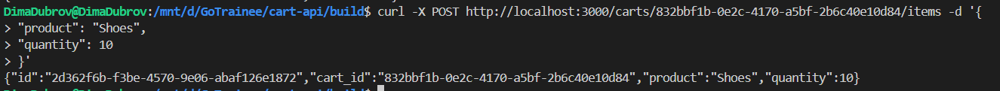
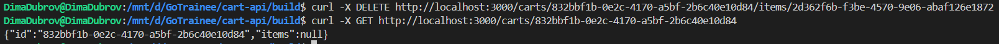

Собственно собрать все необходимое можно при помощи следующих команд:
1. cd build
2. docker compose up --build -d 
Затем для проверки роботоспособности cart-api предлогается выполнить следующие команды:
1. curl -X POST http://localhost:3000/carts
Должно вывести что-то типо этого 

2. curl -X GET http://localhost:3000/carts/{id корзины}

3.  curl -X POST http://localhost:3000/carts/{id корзины}/items -d '{
> "product": "Shoes",
> "quantity": 10
> }'

4. curl -X GET http://localhost:3000/carts/{id корзины}
